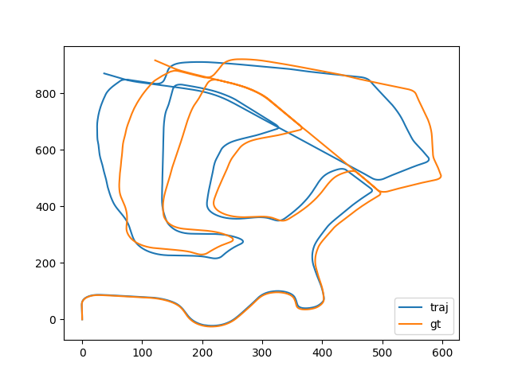

# Stereo Visual Odometry

## Overview
This project implements a simple Stereo Visual Odometry system based on the [NOTF](https://www.honda-ri.de/pubs/pdf/3222.pdf) paper. 

## Dependencies
- OpenCV 4
- matplotlib
- tqdm

To installe required dependencies just execute
`pip install -r requirements.txt` in your terminal.
## Testing on the KITTI dataset
The following command can be used to test on the KITTI dataset : `python -m visual_odometry dataset_path sequence_id`

 Figure 1: Results on sequence 02 of the KITTI dataset 

## References
 - [NOTF by Jörg Deigmöller and Julian Eggert](https://www.honda-ri.de/pubs/pdf/3222.pdf)
 - [Basic Knowledge on Visual SLAM: From Theory to Practice, by Xiang Gao, Tao Zhang, Qinrui Yan and Yi Liu](https://github.com/gaoxiang12/slambook-en)
 - [KITTI dataset](https://www.cvlibs.net/datasets/kitti/eval_odometry.php)
